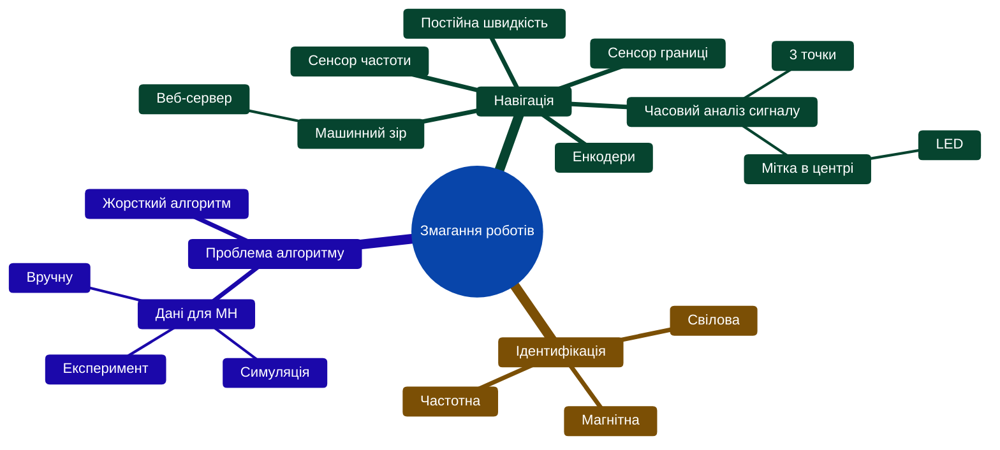

```mermaid
%%{init: {'theme': 'base', 'themeVariables': {'primaryColor': '#3b82f6', 'primaryTextColor': '#fff', 'primaryBorderColor': '#2563eb', 'secondaryColor': '#10b981', 'secondaryTextColor': '#fff', 'secondaryBorderColor': '#059669', 'tertiaryColor': '#f59e0b', 'tertiaryTextColor': '#000', 'tertiaryBorderColor': '#d97706'}}}%%
mindmap
  root((Змагання роботів))
    Навігація
        Машинний зір
            Веб-сервер
        Часовий аналіз сигналу
            Мітка в центрі
                LED
            3 точки
        Постійна швидкість
        Енкодери
        Сенсор границі
        Сенсор частоти
    Ідентифікація
        Свілова
        Магнітна
        Частотна
    Проблема алгоритму
        Жорсткий алгоритм
        Дані для МН
            Експеримент
            Вручну
            Симуляція
```
